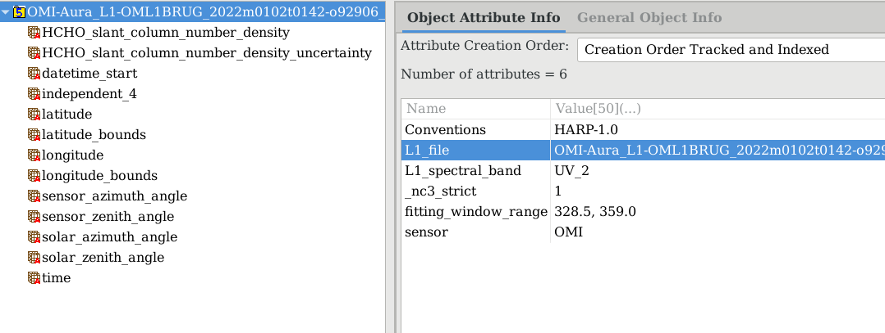

.. _ref1:
Create Harp compliant qdoas output.
====================================

Layout of qdoas file
-----------------------

A qdoas file consist typically out of a main group with variables such as geolocations, time, ... . The subgroup contains the results of a doas retrieval.  Note that the name of main and subgroup can be freely chosen in qdoas. 

Below in picture :numref:`qdoasview`  a typical qdoas layout is shown. 

..  figure:: figs/fig1.png
   :name: qdoasview
   :scale: 50 %
   :alt: hdfview of typical qdoas layout
   :align: center

   qdoas view

Qdoas to Harp mapping
----------------------

A first application is to use the HARP functionalities on a qdoas output file. Therefore we perform some simplifications:

* We split the subgroup into separate files and copy the output in another directory with a filename that gets the suffix of the original qdoas file.  
* geolocations are kept in every output file. A harp  variable is created according to the conventions specified in http://stcorp.github.io/harp/doc/html/conventions/variable_names.html. 
* One Slant column of interest is chosen. (see :ref:`qdref` for how this is done in practice). Currently only one slant column is kept, because the retrieval focuses in most cases on one single
  absorber. Also,  since the calculation of the AMF depends on the absorber, we choose to process AMF and VCD only for one slant column  present in each output file. Note that easily multiple output
  files can be generated which differ in the absorber that is chosen.  

.. include::
   mapping.rst

How the  mapping is  might depend on the type of instrument. Qdoas2harp takes this into account and works for qdoas output from  GOME-2, OMI
and tropomi sensors.

Mapping for OMI.
^^^^^^^^^^^^^^^^^
For OMI an aux. file is needed to include latitude, longitude bounds variables. 

In :numref:`harpomiview` an example is given of an qdoas outputfile after conversion. Note the limited set variables: only geolocations and a slant column of one species with error. 

   hdfview of a converted qdoas ouput file from OMI. 

Based on the main attributes: *sensor, L1_file, L1_spectral_band* the corresponding L2 OMPIXCOR can be found, from which **latitude_bounds** and **longitude_bounds** can be constructed. Note that the
filepath to the corresponding OMPIXCOR file needs to be provided. (see :ref:`ref_cml`)   
Mapping for GOME2A,B and C:
^^^^^^^^^^^^^^^^^^^^^^^^^^^^
For the latitude, longitude bounds: the corners ABCD are reordered as BDCA.

Mapping for Tropomi
^^^^^^^^^^^^^^^^^^^^
